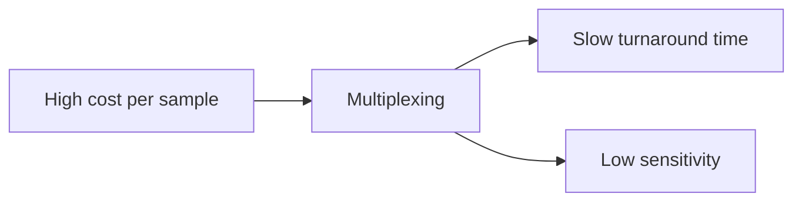

# A roadmap towards ubiquitous metagenomic sequencing

COVID-19 has clearly demonstrated that our ability to detect and contain new pathogens capable of causing a pandemic are not up to the task. This is all the more worrying since we can be confident that SARS-CoV-2 is far from the worst pathogen we could face within our lifetimes. There is therefore a pressing need for technological solutions to enable fast detection of new pathogens and their early containment with rapidly available mass testing.

Metagenomic sequencing (MGS) was previously identified as a technology that could accomplish this goal. However, in COVID-19, we have seen that sequencing has had a limited relative to its huge potential: while it has aided initial sequence identification and variant tracking, a number of bottlenecks prevent its widespread adoption at the point of need.

In this report, we look at these bottlenecks and attempt a first-principles analysis of what it would take to make technology for metagenomic sequencing truly ubiquitous, fit for developed and low-income countries alike. Given the urgency of the issue, we look for solutions involving low technical risk and are can substantially enable our preparedness for potential new pandemics in a 5-year timeframe.

|                           | Current state [Chapter 1](./ch/current-state)           | Target [Chapter 2](./ch/target)                         | Realistic approaches (5-10y) [Chapter 3](./ch/roadmap)  |
| ------------------------- | ------------------------------------------------------------ | ------------------------------------------------------------ | ------------------------------------------------------------ |
| **Pandemic preparedness** | World vulnerable to novel pathogens; majority of infectious disease undiagnosed. | Routine pathogen-agnostic testing for severe respirarory disease. | Metagenomic sequencing widespread in the clinic and point of need. |
| **Sequencing technology** | ~30,000 sequencers, mostly in centralized laboratories.      | Millions of devices at the point of need.                    | Integrated low-cost sample-to-answer devices.                |
| **Sample preparation**    | Complex workflows, lack of standardization, contamination issues. | Low-cost automated qPCR-style sample preparation             | Standardized injection-molded reagent cartridges.            |
| **Sequencing platforms**  | - Cost of goods >$100.  - Pooling necessary - Time to answer >24h. | - COG <<$10 - single sample analysis - <1h to answer. | Low-cost mass-produced nanopore and/or single-molecule optical sequencers. |

> Ubiquitous metagenomic sequencing could dramatically compress the timeline to detection of a new pathogen and at the same time provide an immediate mass testing capacity

## Current State

### qPCR tests are the gold standard

### High cost per sample necessitates multiplexing

The cheapest runs of Illumina instruments currently cost \~\$300 to \$500[⁹](https://www.zotero.org/google-docs/?NJMTcC). To our knowledge, the cheapest run (Oxford Nanopore’s Flongle) costs closer to $100[¹⁰]. Even at this price point, healthcare providers are unlikely to use these instruments for sequencing single samples.

Batching and **multiplexing** multiple samples for a single sequencing run can significantly reduce the cost per sample, but introduces a delay before sequencing can begin. The delay is dependent on the nature of the testing facility and the number of samples being received per day, but typically, this is on the order of a week. This **delay of days to weeks** is likely unacceptable in an infectious disease diagnostic context where we ideally want to provide results as rapidly as possible.

Another downside of multiplexing onto a single chip is the significant reduction in sensitivity of the test, since the sequence coverage per sample reduces proportional to the number of samples.

Therefore, the high single-run cost for current instruments makes them a poor fit for diagnostic applications. This is the case even if we look at the COGS (Illumina \$50 to \$100s, Oxford Nanopore \$50 to \$450 based on stated margins^([1](https://www.zotero.org/google-docs/?uZfJ69) [12](https://www.zotero.org/google-docs/?tljpmF)). Cheaper options could make running single-sample tests economically viable.

### Complex worfklows limit use

Sequencing-based assays are complex and typically require multiple hours of skilled labor to execute (both in the wet lab and data analysis).

A pushbutton “sample-to-answer” sequencing platform could allow minimally-trained personnel to load a sample and walk away from the device. Such a platform could have a major impact on the ease of implementation of sequencing-based diagnostics. Yet, no sample-to-answer sequencing platform currently exists.

Efforts have been made to automate parts of the sample preparation and library preparation process workflows, but these have largely addressed research applications or users who are comfortable investing effort in developing automation systems to process large numbers of samples in centralized labs. No low-cost fixed protocol suitable for use in a clinical context is available.

### Long time to answer disqualifies sequencing in for infectious disease diagnosis

We previously discussed how the requirement of multiplexing can increase diagnostic turnaround time by days to weeks. Sending samples to a centralized lab followed by the execution of complex workflows by trained personnel also adds significantly to the time to answer. Indeed, current metagenomic-based pathogen tests often have a turnaround time of more than two weeks [¹³](https://www.zotero.org/google-docs/?7jVZxG).

On the sequencing technology front, Illumina’s runs typically fall between 24-48 hours, while their fastest runs are \~4 hours[¹⁴](https://www.zotero.org/google-docs/?RCkl9s),. While this may be sufficient for some use cases, it is hard to see how a truly ubiquitous technology base could be built on this base. However, nanopore and single-molecule approaches can currently provide sequencing data in a \<1-hour timeframe.

[Sample and library preparation](https://sequencing-roadmap.org/sample-prep) are also significant bottlenecks here. This is strongly dependent on the sequencing technology being used but tandard protocols typically take more than 2 hours. In later sections, we discuss approaches which can provide sequencing-ready DNA in \~10 minutes[¹⁵](https://www.zotero.org/google-docs/?gUoxVG).

## Target

## How to Get There
