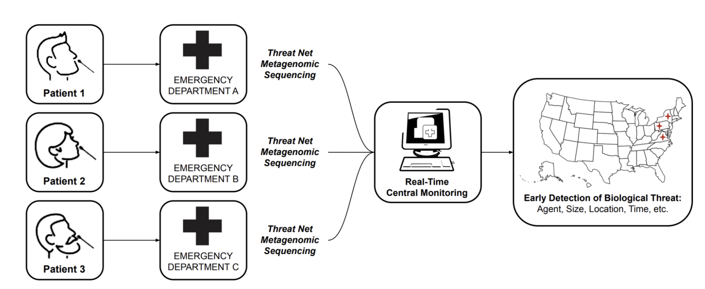
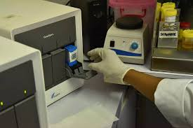

<head>
    <link rel="stylesheet" href="tufte.css"/>
  </head>

Authors: Nava Whiteford, Andrew Heron, Leonard McCline, Ales Flidr, Jacob Swett.
NW performed the majority of research and analysis. AH provided guidance on research and analysis. LM provided research assistance and performed modeling. AF conducted expert interviews and edited the document. JS conceptualized the project.
    Funding was provided by <a href="https://www.openphilanthropy.org">Open Philanthropy</a> and organized by <a href="https://www.convergentresearch.org">Convergent Research.</a>

Imagine a world in which every clinician and patient around the world had access to a simple device capable of detecting any virus or bacterium causing disease in a symptomatic patient. Such a world would be much better positioned to diagnose and treat infectious disease and to detect novel emerging pathogens before they cause a devastating pandemic. [Metagenomic sequencing](https://www.nature.com/articles/s41576-019-0113-7) (MGS) has the potential to become such a universal diagnostic. However, it is not yet ready for prime time: complex workflows and high costs prevent widespread adoption.

In this report, we ask how MGS could become widely available, at least as much as diagnostic PCR machines are today. The answer we arrive at is that a device capable of performing 10 million RNA reads in less than an hour with minimal library preparation would be well positioned to deliver on this goal. We then review the current technological landscape and conclude that adaptation of least two mature approaches, single-molecule optical and nanopore sequencing, could meet these specifications if optimized for human respiratory samples.

## Motivation
The first COVID-19 infection occured in mid-October to mid-November of 2019, [at least six weeks earlier than the Wuhan cluster of infections was identified in late December 2019](https://www.science.org/doi/10.1126/science.abf8003). The SARS-CoV-2 genome was only made publicly available in January 2020, more than two months after the first human transmission. This delay resulted in millions of deaths and trillions of dollars in economic costs.

 
Proposed architecture of a network of MGS early detection sites in emergency departments. Source: <a href="https://pubmed.ncbi.nlm.nih.gov/37367195/" target="_blank">Sharma et al. (2023)</a>
 COVID-19 - far from the worst pandemic we could face within our lifetimes - has clearly demonstrated that our ability to detect and contain new pathogens is inadequate. The diagnostic technologies we use for infections at the point of care are designed for a small set of known pathogens and in principle incapable of recognizing the outbreak of an unsuspected or unknown pathogen.

There is therefore a [pressing need](https://councilonstrategicrisks.org/wp-content/uploads/2021/07/Toward-A-Global-Pathogen-Early-Warning-System_2021_07_20-1.pdf) for a near-universal diagnostic to enable rapid detection of all pathogens and their early containment. While it is impossible to predict in advance the nature of a novel threat, we can be confident that its genetic information will be encoded in DNA and RNA. There is therefore a clear candidate technology, the one that [identified SARS-CoV-2](https://www.nejm.org/doi/10.1056/NEJMoa2001017) where others failed: metagenomic sequencing (MGS). 

MGS, also known as unbiased sequencing, is based on the simple idea of analyzing all DNA or RNA in a sample in a hypothesis-free manner. MGS can be leveraged for early detection in a number of ways, including sequencing sites searching for emerging pathogens in  [wastewater and waterways](https://arxiv.org/abs/2108.02678), or strategic testing of "sentinel" populations. While these approaches should certainly form an important part of a layered early detection system, we focus this roadmap solely on the vision of MGS deployed widely [at the point of care](https://en.wikipedia.org/wiki/Point-of-care_testing) for detection of pathogens in human respiratory samples. The key reasons for this focus are

- Distinguishing between signal and noise is likely to be easier in human respiratory samples than in environmental ones.
- Early detection of pathogens will only be enabled when MGS is deployed at a large scale. If MGS proves to be clinically useful and cost-effective, it can scale up naturally within the current health-economic system, without the need for continued public or philanthropic support.
- Detecting a pathogen of concern in an individual sample immediately enables effective quarantining and contact tracing.
- Widely available MGS testing would put us in a position where mass testing of a novel pathogen is possible from "day zero" of a potential pandemic, saving the months it would take to develop and approve novel primers for PCR tests.

In COVID-19, we have seen that sequencing has had a limited impact relative to its huge potential: while it has aided initial sequence identification and variant tracking, a number of bottlenecks prevent its widespread adoption directly at the point of care. In this report, we analyze these bottlenecks and ask what it would take to **make the technology for metagenomic sequencing truly ubiquitous**, fit for developed and low-income countries alike in a 10-year timeframe.

## The goal: taking inspiration from PCR
What is it going to take to make metagenomic sequencing ubiquitous in clinics around the world? A necessary condition is the existence of an affordable, easy-to-use technical solution. 

A natural success story to draw on is that of point-of-care polymerase chain reactions (PCR) machines. Through long-term development, PCR devices were adapted from machines that took several hours to run and were confined to specialized laboratories to affordable, compact, "push-button" objects that deliver results within an hour directly at the point of care, without the need for specialized labor. According to a [WHO report](https://apps.who.int/iris/rest/bitstreams/1060638/retrieve), "real-time PCR has engendered wider acceptance of the PCR due to its improved rapidity, sensitivity, reproducibility and the reduced risk of carry-over contamination".

 A Cepheid GeneXpert device. Source: <a href="https://www.msfaccess.org/principles-access-multi-disease-molecular-diagnostics" target="_blank">MSF</a> 

A concrete example of this success is the [Cepheid GeneXpert](https://www.cepheid.com/en-US/systems/genexpert-family-of-systems/genexpert-system.html) device. Originally developed for the detection of anthrax, it has been adapted to many other infectious diseases following collaboration between Cepheid and international organizations and philanthropic bodies. Through successive rounds of cost-optimization, the device got to a point where it became practical even in developing countries for testing diseases such as tuberculosis or HIV. This resulted in an overall install base of some [22,000 devices even prior to the COVID pandemic](https://cepheid.mediaroom.com/2019-04-15-Cepheid-Announces-FleXible-Cartridge-Program), which [increased to 40,000](https://www.genomeweb.com/business-news/danaher-q4-revenues-rise-21-percent) between 2019 and 2022. This enabled relatively rapid development of primers for testing the presence of SARS-CoV-2 in clinical samples without the need for developing novel infrastructure.

PCR devices can also test for multiple pathogens or genes (such as those conferring antimicrobial resistance) in parallel. The [BioFire FilmArray](https://www.biofiredx.com/products/the-filmarray-panels/), for instance, offers simultaneous sensitive detection of 20-40 targets in samples including repiratory (sputum, bronchoalveolar lavage), blood culture, cerebrospinal fluid or gastrointestinal.

However, PCR cannot in principle detect unknown or changing targets. For example, a novel gene conferring drug resistance, or a novel virus strain, require the design of novel primers. Perhaps more importantly, the emergence of a completely novel pathogen (in recent decades, consider, SARS-CoV-1 and 2, HIV, Ebola and Marburg virus, for instance) would go completely undetected.

In principle, then, MGS has a clear advantage, as it can detect any pathogen, whether bacterial, viral, fungal or otherwise. Despite this advantage, however, it is difficult to imagine that MGS might become truly ubiquitous without being close to matching PCR on the set of characteristics that made it successful.

In particular, we  believe that MGS-based diagnostics should aspire to meet these **<u>requirements</u>**:
- **Sensitivity comparable to qPCR** (matching a cycle threshold of 35).
- **Workflow should be "push-button"**, requiring minimal operator time and skill (<5 minutes).
- **Time to answer** should be **less than 1 hour**.
- The **cost** of a single test (COGS) should be **comparable to qPCR ($10)**.
- The **device itself should be affordable** (<$30,000, ideally $10,000) and compact, ideally portable.
- **Supply chains** should not be overly complex.

## Current sequencing landscape
As table 1 illustrates, no sequencing device currently comes close to meeting these specifications. Sensitivity itself is achievable with sufficient sequencing depth (see [section on sensitivity](#sensitivity)) but incompatible with the other requirements of cost and time to answer. Workflows involve complex sequential steps in sample and library preparation and typically require hours of work by trained experts. Automated and integrated solutions are only available at high costs for specialized laboratories. Cost per sample can be reduced below $10 only by sequencing many samples in parallel, which is not practical in the point-of-care context, as this step introduces both a significant delay in time to answer.

   Table 1. Documented and estimated parameters for available sequencing solutions.
a. If a 36SE run on the SB flow cell were offered, we would expect a faster (perhaps around 4-6 hr, similar to the MiSeq) run time. 
b. Run time includes DNA nanoball loading into the flow cell. 
c. Nanopore sequencing allows real-time analysis during the run. Runs can be stopped within minutes of starting or up to 72 hrs. 
d. Nanopore sequencing scales in throughput in a roughly linear manner as fragment length decreases. Ref 30 demonstrates 0.625 reads / hr with 400 bp amplicons in S1. 
e. Nanopore sequencing is capable of sequencing a wide range of nucleotide lengths (>100 kb). 200 bp was chosen to set a fixed throughput value. 
f. Direct RNA sequencing on the MinION is less mature and currently exhibits notably poorer performance. 
g. Flongle exhibits roughly 5x lower throughput than a MinION flow cell

    

The need for rapid results speaks against the majority of sequencing platforms based on **<u>colony-based approaches</u>**. Illumina's [cluster generation step alone takes at least 60 minutes](https://aseq.substack.com/p/why-does-cluster-generation-take). In addition, this approach requires a large set of reagents that would add significant complexity and cost to the design of a sample-to-answer system. New companies (e.g MGI, Singular Genomics) emerged following the expiration of Illumina's core intellectual property. While this development is likely to decrease consumable and device costs by driving down margins and enabling innovations, the new players are unlikely to change this fundamental limitations. To our knowledge, the most serious attempt at decreasing the time requirements is the use of [Lighting Terminators](https://www.genomeweb.com/sequencing/lasergen-says-its-new-reversible-terminators-could-improve-several-sequencing-pl). One company, 454.bio, has set a goal to achieve a 1-hour sample-to-answer runtime with this approach.

While this and other future innovations could make some colony-based approaches viable, a more natural category to focus on is that of **<u>single-molecule approaches</u>**. Single-molecule approaches have the advantage of potentially minimal library preparation and compatibility with a real-time readout, with results delivered in minutes following sample and library preparation. The two main approaches in this category as of 2023 are nanopore sequencing and single-molecule optical (SMO) sequencing.

As of 2023, the cheapest available instrument for runs on single samples is Oxford Nanopore (ONT)'s Flongle, whose consumables sells for $90 and likely costs ca. $50 to make. Optimized clinical workflows utilizing real-time sequencing with ONT's MinION can achieve a time to answer of 6 hours ([Charalampous 2019](https://pubmed.ncbi.nlm.nih.gov/31235920/)). This is driven primarily by sample and library preparation, as sequencing itself takes <30 minutes for pathogen classification.

In the rest of this report, we ask what requirements a sequencing device has to meet in order to match all of the above criteria. In particular, we ask:
- How does clinical sensitivity translate into sequencing device specifications?
- How could the sample and library preparation workflows be automated to meet the cost and time to answer requirements?
- Which sequencing platforms [could meet these criteria](#dev-goals), and what would be needed to achieve that?
- What does this imply for research, development and policy priorities?

## Towards a sample-to-answer system
Perhaps the greatest contrast between sequencing and PCR tests today lies in the **<u>complexity of workflows</u>**. As previously mentioned, even workflows optimized for the ICU setting require a clinical microbiology laboratory to execute. Interviews with practitioners at the forefront of clinical MGS adoption reveal that training new personnel in MGS workflows takes months and results vary significantly based on operator skill.

In contrast, PCR assays are straightforward. To obtain a clinical answer with the previously mentioned Cepheid GeneXpert, the user places the sample into a cartridge, inserts it into the device, and waits for approximately 45 minutes to obtain the result. This simplicity is currently unattainable in the sequencing world, where the standard procedure includes complex sample and library preparation workflows. 

Given the ease of use and efficacy of Cepheid's sample-to-answer qPCR platform, it is valuable to explore whether similar principles could be applied to sequencing technologies. Can we envision a device akin to Cepheid's, but centered around sequencing instead of qPCR? This would potentially offer streamlined, rapid sequencing workflows, which could dramatically accelerate the field.

Cepheid's first and second generation instruments were incapable of processing raw samples directly. To establish a comprehensive sample-to-answer system, Cepheid tackled this limitation by incorporating sample preparation into the platform.  This was accomplished by designing a fluidic cartridge capable of processing raw samples and concurrently integrating a qPCR reaction tube. Reagents can be preloaded, with no fluidic coupling to the instrument. The instrument interfaces with the cartridge via a reagent selection valve and plunger. The cost of goods for the cartridge, including reagents, [has been estimated at $10](https://msfaccess.org/sites/default/files/2019-12/2018%20COGS%20analysis%20of%20Xpert%20MTB_RIF%20Ultra%20cartridges.pdf) and marketed at prices typically exceeding $20.

A sketch of a sample and library preparation cartridge, Nava Whiteford. 
While achieving the same simplicity for MGS may seem like a tall order, it is important to note that currently available have been designed to be versatile and serve a number of applications. For the MGS use case, workflow can commit to a particular sample type (e.g. nasopharyngeal, upper nasal or saliva), consistent input volume and RNA sequencing only. If we strip sequencing to its bare essentials, then, the complexity need not be much greater than that of qPCR. Like qPCR, sample preparation will, for the foreseeable future, need to involve cell lysis and, unless before direct RNA sequencing becomes more reliable, a reverse transcription step to convert RNA to complementary DNA. Further needed removal of unwanted nucleic acid material (in this case, DNA with DNAase) and, in most cases, the addition of adapters for the sequencing platform in question.

Developing a cartridge for this use case and integrating the whole system into one box can be done with relatively little technical risk. Why, then, has no player developed such a system? The key reason, we believe, is the lack of a platform that could achieve the sufficient sequencing depth at a low enough cost without the need to analyze multiple samples in parallel. In the next section, we ask what the required sequencing depth for a MGS diagnostic is likely to be.

<h2 id="sensitivity">Requirements: throughput, read length and accuracy</h2>
The most important question any candidate test for infectious disease has to address is whether its sensitivity of detection is sufficient. Sequencing a human clinical sample can obviously achieve very high levels of sensitivity: a sequencing run of Terabases on a single sample should comfortably detect even pathogens that are very low in abundance. However, when the requirements of cost and time to answer are added, practical sensitivity of sequencing is a question that has to be determined.

PCR tests are characterized by a high sensitivity, or very low limit of detection (LoD): in principle, they can detect the presence of a target fragment with only a handful of copies present in a sample. The required sensitivity for viral infections (which are generally less abundant and thus more difficult to detect) is typically at least 1,000 copies per mL (or 1 copy per uL) 

PCR has a key advantage over sequencing:  because PCR targets a short, unique region of a genetic sequence, it is _insensitive to background material_. A high fraction of human material (mostly rRNA in the case of RT-qPCR) or bacterial material will have only a minor effect on the sensitivity of qPCR. In other words, the limit of detection relies on the sample's _absolute abundance of the target_. MGS, however, is _sensitive to background material_. To ensure that the target of interest is detected, one must also sequence through background fragments until the target is reached. Thus, the sensitivity of MGS relies on the _relative abundance_ of the target among the other nucleic acid in a sample. 

In the context of PCR, therefore, it is sufficient to think of the absolute number of copies per unit of volume (e.g. mL). For instance, [HIV in blood is present at relatively low copy numbers ranging from <0.2 to 40 copies/ml](https://www.ncbi.nlm.nih.gov/pmc/articles/PMC7646261/). For MGS, we care not only about the number of pathogen genome copies per unit volume, but also about the number of human (and non-pathogenic microbial) RNA in a sample. In typical human clinical samples, host nucleic acids are orders of magnitude more abundant than those of the pathogen. For example, the typical fraction of SARS-CoV-2 RNA in nasopharyngeal samples was between 0.01% (or one fragment in 10,000) and 0.001% (one in 100,000). However, viral load has been found to [span some 8 orders of magnitude](https://www.ncbi.nlm.nih.gov/pmc/articles/PMC7302192/figure/F2/), with loads as low as tens of copies/mL found in more than 1% of cases and a high-sensitivity device therefore has to be equipped for even low abundance pathogens.

In sequencing, likelihood of uniquely detecting a pathogen follows directly from the sequencing depth applied (or the number of reads analyzed by a sequencer). Unfortunately, sequencing depth results in high costs and, for most approaches, a long turnaround time. Therefore, a number of sample preparation steps have been developed to decrease the sequencing depth required for clinical samples. The relative fraction of a pathogen can be increased in two ways: either by amplifying the pathogen of interest or by removing material that is not of interest, in this context human RNA. **<u>Amplification</u>** is not naturally suited for the purpose of a unbiased test, as one needs to know what pathogen to amplify. In practice, hybrid approaches where known low-abundance pathogens are amplified using PCR may employed. However, in our analysis, we assume that no amplification will be used.

**<u>Depletion</u>** methods remove known non-target nucleic acids (e.g., host material) from a sequencing library. Doing so can reduce read depth requirements and increase detection sensitivity for target (pathogen) nucleic acid. When sequencing RNA libraries, highly repetitive ribosomal RNA (rRNA) can constitute 60-95% of a sample, making it a prime target for depletion. As indicated by interviews with practitioners, [Qiagen’s FastSelect](https://www.qiagen.com/us/products/discovery-and-translational-research/next-generati on-sequencing/rna-sequencing/ribosomal-rna-and-globin-mrna-removal/qiaseq-fastselect -epidemiology-kits) is currently the most viable alternative, removing >95% rRNA (host and bacterial) in 14 minutes. There are yet to be sufficient studies examining the effectiveness of FastSelect across various sample types, but in a case where FastSelect was applied to CSF samples, practitioners report a 10x reduction in read depth requirements (from 10-20M to 1-2M). Unfortunately, FastSelect costs >$50/sample, though labs [have reported](https://www.czbiohub.org/rapid-response/resources/) similar depletion results after diluting the reagent 10X to reduce cost. The cost and time budget may be justified in many or all cases and cost reduction for rapid depletion kits are a high priority for development. However, here we conservatively assume no depletion when calculating sequencing depth requirements.

  Ct values vs reads per million. Source: Babiker et al. 2020. How many reads does a sequencing run have to generate? Of course, no diagnostic is a replacement for clinical judgment. Metagenomic sequencing and qPCR share the same issue, namely that the presence of nucleic acid material does not necessarily imply infected state. In clinical practice, cutoffs for clinical significance will likely be determined for each pathogen or pathogen class as information about typical abundance in non-infected individuals is accumulated. As an example, in a pulmonary sample study, <a href="https://www.ncbi.nlm.nih.gov/pmc/articles/PMC6784263/">Zinter et al.</a> used two criteria: a normalized score of reads per million (rpm) and the deviation in abundance from other samples in cohort and determined the cutoff for bacteria as a deviation of Z&gt;2 or 10 rpm, and for viruses and fungi as 1 rpm. <a href="https://www.ncbi.nlm.nih.gov/pmc/articles/PMC6499319/">Miller et al.</a> developed threshold criteria based on the detection of nonoverlapping reads from ≥3 distinct genomic regions.

With these goalposts in mind, what sequencing depth is required? In the context of COVID, many studies have attempted a mapping between sequencing limits of detection and the relative fraction (or expected number of reads) in respiratory samples. For instance, [Babiker et al.](https://journals.asm.org/doi/full/10.1128/JCM.02142-20) found robust detection (>10 reads per million) at Ct of 32.

In the [technical appendix on sensitivity](sensitivity.md), we approach this question both via modelling and by reviewing the empirical literature. Based on this exercise and interviews with practitioners, we conclude that a **<u>sequencing depth of 10 million reads should robustly achieve a Ct of 33</u>** for the vast majority of pathogens found in respiratory samples, without depleting human nucleic acids or amplifying targets. Given our time budget of 1 hour, this requirement leads quite directly to a throughput of ca. 10M reads/hour. It is worth noting, however, that this conclusion may not hold for sample types with greater abundance of human RNA such as blood, where low-abundance pathogens such as HIV are [present at concentrations](https://translational-medicine.biomedcentral.com/articles/10.1186/s12967-020-02368-y/figures/3) requiring an order of magnitude or two greater sequencing depth for a corresponding amount of depletion.

|Ct|Copies per mL (approx.)|Reads per million|
|:---:|:---:|:---:|
|36|10|0.1|
|33.5|100|1|
|31|1,000|10|
|28.5|10,000|100|

Rough equivalence between Ct values, expected reads per million for SARS-CoV-2 in nasopharyngeal samples, no amplification and depletion. Based on [Babiker et al. (2020)](https://journals.asm.org/doi/full/10.1128/JCM.02142-20), [Kudo et al. (2020)](https://www.biorxiv.org/content/10.1101/2020.06.16.155887v1.full.pdf), [Arnaoud et al. (2021)](https://www.ncbi.nlm.nih.gov/pmc/articles/PMC7929140/). See [modeling spreadsheet](https://docs.google.com/spreadsheets/d/1rXfCUE1XGXAcFTdEugw1uRm5aNi8CoAFirWUsG0BzUc/edit#gid=1993789150) for more detail.

 
A sketch of a sample and library preparation cartridge, Nava Whiteford

Sequencers also vary widely on two other variables: read length and single-base accuracy. Both of these features are highly desirable in research contexts where changes of even a single mutation are often the object of study. However, [our simulations](https://aseq.substack.com/p/what-length-reads-to-you-need-for) suggest that for the task of correctly classifying a known virus, or detecting a high abundance of unknown material, read length and accuracy requirements are comparatively modest. We estimate that **<u>read length of only 25 bp and single-base accuracy of 95% are sufficient for unique viral detection</u>**, given sufficient sequencing depth. This has important implications for technology development goals, as we discuss in the next section.

<h2 id="dev-goals">Development goals</h2>
Having determined these targets for sequencing platforms, we can now formulate concrete development goals for the previously mentioned candidate single-molecule platforms, focusing on nanopore and single-molecule optical sequencing. It is worth emphasizing that while we expect viable solutions in the next 5-10 years to come from these two categories, we cannot confidently rule out that a viable solution will emerge from a colony-based method (e.g. if cluster generation time is reduced by an order of magnitude) or from unexpectedly fast progress on a novel technology (such as solid-state nanopores).

### Nanopore platforms
 
 MinION is typically known to achieve on the order of 100,000 reads in an hour. However, these numbers are achieved in typical experiments that utilize MinION’s long reads and more reads can be achieved when input nucleic acid is more fragmented. Minion has 512 active channels, so if we assume the system is saturated (sufficient nucleic acid in the chamber for the throughput to function optimally) and a standard translocation speed of 420 bp/s, we need an average fragment length of ~775 bp to get 1M reads 

As noted earlier, nanopore platforms already meet the key requirements of fast time to answer, sufficient througput and relativecly simple library preparation. However, the greatest barrier for a nanopore-based diagnostic platform is the high COGS of consumables. At present, this is primarily driven by the cost of manufacturing nanopore arrays. From published patents, it is possible to infer that the design employed by the leading player, Oxford Nanopore, presently requires non-standard MEMS fabrication. This is largely driven by limited capacity of MEMS fabs globally, rather than by the fundamental cost of materials and fabrication procedures.

Composition of an ONT MinION device. Source: <a href="https://www.nature.com/articles/s41587-021-01108-x">Wang et al. (2021)</a> 

Another technically feasible approach would be to change the manufacturing process to a more standard and less costly one. In the context of solid-state nanopore arrays, the company Elements has [demonstrated](https://elements-ic.com/wp-content/uploads/2019/07/eNPR-–-Nanopore-Chip-assembly-and-measurement-instructions.pdf) that it is possible to directly fabricate silver electrodes on printed circuit boards. Printed circuit boards with the required area (10 squared milimeters for ONT Flongle) and feature size (down to 125 microns) are available for $0.50. Such cost reduction would enable a system with sufficient throughput that is competitive with qPCR on cost. A prototype system of this sort could likely be developed with relatively little technical risk within existing IP constraints.

<!--The most interesting of these for our application are solid-state nanopore approaches, which could potentially retain many of the advantages of protein nanopore platforms, while also potentially rectifying many of its problems. Specifically, solid-state nanopore platforms promise higher accuracy, throughput, lower cost, and simpler sample preparation. However, it is worth noting that this technology is at an experimental stage: research has been underway for more than 20 years and, to date, no reproducible demonstration of near single base resolution sequencing has been shown.-->

### Optical platforms
Single-molecule optical technologies were brought to the market by Helicos (now defunct) or [Pacific Biosciences](https://www.pacb.com/). Considering this class of technologies as a candidate platform may be surprising, as they have generally been embodied as costly, "fridge-sized" instruments with long library preparation (>[3 hours](https://www.pacb.com/products-and-services/consumables/library-prep-and-barcoding-kits/)). However, this is driven not by the fundamental needs of the platform, but rather by the market demand for high single-base accuracy and long read length. If these requirements are relaxed, single-molecule optical approaches can achieve very simple sample preparation and a low cost of consumables.

 
Sketch of a cost-optimized single-molecule optical platform One of the authors (Nava Whiteford), has previously proposed a minimalist adaptation of the Helicos platform, based on single-molecule sequencing-by-synthesis, for infectious disease testing. This method's combination of short reads (~25 bp) and base calling accuracy of ~95% has made it a poor fit for whole genome sequencing. At the same time, optical instrumentation has historically been too expensive for this platform to target a low instrument cost (cMOS cameras cost over $200,000). However, in 2023, $300 consumer-grade cameras are sufficient for this sequencing approach and a full instrument can be assembled for <$1,000. 

Like nanopore sequencing, this platform is capable of real-time analysis and at a read length of 25bp can finish a run in minutes. The chief advantage of this approach lies in extremely simple library preparation and the potential for direct RNA sequencing. The key uncertainty is in throughput: the goal of 1M reads is easily achievable in a fixed imaging region, whereas 10M reads may prove difficult to achieve.

In the context of the more familiar PacBio platform, one can readily envision an adaptation to a miniaturized, integrated system with low-cost consumables. For instance,
- The SMRTBells library preparation introduced to drive accuracy  to >99.9% and read length to ~15 kb is not required for pathogen detection, as argued above. Without these requirements, library preparation for optical methods can be as fast as for nanopore sequencing (~5 minutes).
- Photonic chips need not be monolithically integrated. Consumer-grade cameras available for ~$300 have resolution sufficient for the accuracy requirements of a MGS diagnostic.

These design decisions should be compatible with a single-base accuracy of >95% and read length of >25 bp. The sequencing readout of an optical platform such as PacBio or Helicos can be achieved within less than 10 minutes with these specifications.

A key advantage of an optical approach relative to nanopore sequencing is that it is compatible with the use of a "dry" chip and hence a clear path to a consumable cost of $10 or less. Achievable throughput in a low-cost platform will be limited by compatibility with low-cost cameras, but the goal of 10 million sensing regions (and hence reads) appears achievable.

A particularly promising avenue is that of [electro-optical zero-mode waveguides](https://onlinelibrary.wiley.com/doi/10.1002/adma.202108479), which may enable substantially lower input requirements, obviating the need for random amplification of nucleic acids in a sample.

|**Platform**|**Challenge**|**R&D or engineering goals**|
|---|---|---|
|Nanopore|Consumable cost|Shift to conventional fabrication methods or increase pore density.|
||Throughput|Already sufficient assuming for short reads; translocation speed could be higher if single-base accuracy is relaxed|
|Optical (PacBio)|Device cost|Commit to single workflow, employ cheaper optical instrumentation (e.g. TIRF)|
||Long library prep and runtime|Sacrifice read length and single-base accuracy to simplify library prep.|
|Optical (Helicos, Reticula)|Low TRL|Invest in development of novel chemistries.|

<!--### Fast, pathogen-agnostic depletion methods-->

## How to get there
<!--Sequencing technologies are complex and require significant investment. This is most recently apparent in the development of nanopore sequencing: this effort took more than 25 years of active development, and billions of dollars of academic and commercial funding. Given that we are interested in approaches that can make a difference in clinical diagnosis and pandemic preparedness in the next 5-10 years, we discuss lower-risk approaches developing low-cost, high-speed sequencing platforms which build up existing sensing methodologies. It should be noted, however, that while these approaches are lower risk, bringing any novel sequencing platform to commercial launch will ultimately likely require at least \$100M, and that there is still significant market, regulatory and technical risk. Government and philanthropic intervention may therefore be needed, unless a novel way to de-risk development of these technologies is found.-->

Based on the previous analysis, there are at least two independent pathways that are likely to meet the criteria for a viable point-of-care MGS device. If this is the case, **<u>why would this need not be addressed by the market</u>**? After all, sequencing is attracting large amounts of private investments and the prospect of millions of tests per year should be sufficient to stimulate development. Conversely, the fact that sequencing companies have not developed such a device should be taken as evidence that there may be some fundamental roadblock preventing its development.

While this "efficient market assumption" is a reasonable starting point, there are also reasons to believe that there is significant room for improvement. A number of observations, informed largely by the authors' experience with the sequencing landscape, as well as conversations with experts, push in this direction:
- Development is driven by **customer demand**. The primary market for sequencing instruments is in research and high-end diagnostics (e.g. cancer). In these contexts, the primary consideration is often extraordinarily high accuracy, as the correct identification of every single base is potentially informative. The task of correctly classifying a pathogen of interest or detecting an anomaly does not require such high single-base accuracies, as we justify later. Similarly, the requirements for read length, as well as sequencing depth, are much lower.
- **Time to answer** of hours or days is not a limiting factor in many research contexts. Typical workflows are structured around large runs, often counted in thousands of billions of bases (e.g. ONT PromethIon, Illumina Novaseq). Researchers typically care about a low cost per base for these large runs. Large, high-end instruments can minimize this cost per base.
- The sequencing market is still comparatively small, dominated by a few players with relatively enforceable intellectual property, and **freedom-to-operate** is thus relatively limited.
- While the "low-end" market is potentially large in volume, there is presently **no clear demand signal** that would justify the relatively large investments (at least tens of millions of dollars for a working product) necessary.

By [our estimates](https://41j.com/blog/2022/09/global-sequencing-capability-notes/), more than half of global sequencing capacity in terms of number of bases sequenced annually is accounted for by Illumina NovaSeq alone. NovaSeq is a $1 million instrument that yields up to 6 Tb of data per run with an error rate on the order of 0.1%. A single run can cost more than $5,000. This large share of sequencing capacity is accounted for by only some 1500 instruments in large laboratories.

Another key player, Oxford Nanopore (ONT), is known for its relatively affordable, miniaturized devices such as the MinIon or Flongle. In 2021, however, fully 55.7% of ONT's revenue was generated by its 67 [PromethION](https://nanoporetech.com/products/promethion) instruments (see page 40 of [ONT's annual report](https://nanoporetech.com/sites/default/files/s3/investors/reports/ONT%20Annual%20Report%202021.pdf)), each of which can generate up to 12 Tb of data, with device costs ranging from $225,000 to $450,000.

 
Estimates of global sequencing capacity

What, then, could shift these market dynamics? Broadly, we see two approaches to this problem:
- **Push mechanisms** have historically been successful in stimulating R&D in sequencing. The Human Genome Project and his successors (e.g. the $1,000 Genome Project) paved the way for technology development by direct public investment into R&D. Similarly, a $10 MGS device provides a challenging but achievable goal around which activity can be catalyzed by direct grants or other forms of support.
- **Pull mechanisms** such as advanced market commitments may be appropriate here, as the target product profile is readily definable in this context, and achievable in a timeframe of less than 5 years. At present, building a fab from scratch, which could pave the way towards low-cost nanopore devices, is an endeavor in the hundreds of millions of dollars and is difficult to justify given the lack of a credible demand signal. However, at volumes comparable to qPCR diagnostics (>1M units a month), such investment could be justified. Tools such as advanced market commitments, as well as credible signals of interest in a MGS diagnostic platform from national and international organizations, could pave the way towards such investments.

<!--
In addition to direct financing, much work needs to be done on the broader enabling factors for adoption of MGS. Developing a successful product will require many rounds of iteration with practitioners to determine how exactly metagenomic sequencing is going to fit into clinical workflows. There is also a well-recognized set of regulatory challenges. At present, there is no regulatory approval for a fully pathogen-agnostic diagnostic. It is therefore possible that MGS may first need to be approved as a very broad respiratory panel providing clinical answers for a broad but finite set of pathogens, while off-target results may be reported to public health authorities without entering the diagnostic record.
-->
