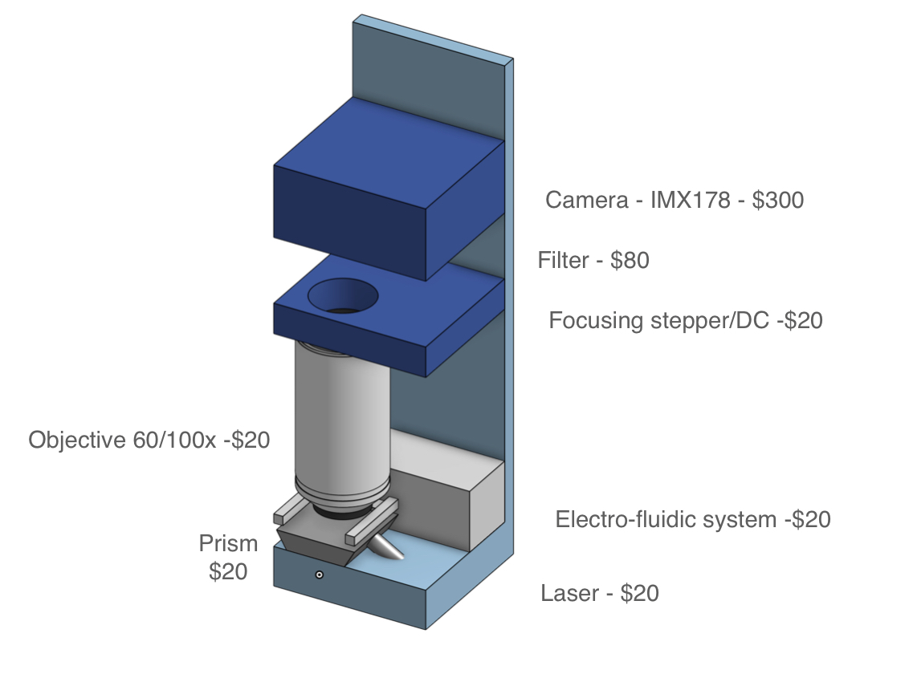

# A roadmap towards ubiquitous metagenomic sequencing
Imagine a world in which every clinician and patient around the world had access to a simple device capable of detecting any virus or bacterium causing disease in a symptomatic patient. Such a world would be much better positioned to diagnose and treat infectious disease and to detect novel emerging pathogens before they cause a devastating pandemic. [Metagenomic sequencing](https://www.nature.com/articles/s41576-019-0113-7) (MGS) has the potential to become such a universal diagnostic. However, it is not yet ready for prime time: complex workflows and high costs prevent widespread adoption. 

In this report, we ask how MGS could become widely available, at least as much as diagnostic PCR machines are today. The technical answer we arrive at is that a device capable of performing 10 million RNA reads in less than an hour with minimal sample preparation would have sufficient sensitivity to deliver on this goal. We then review the current technological landscape and conclude that at least two approaches, single-molecule optical and nanopore sequencing, could be adapted to meet these specifications.

## Motivation
The first COVID-19 infection occured in mid-October to mid-November of 2019, [at least six weeks earlier than the Wuhan cluster of infections was identified in late December 2019](https://www.science.org/doi/10.1126/science.abf8003). The SARS-CoV-2 genome was only made publicly available in January 2020, more than two months after the first human transmission. This delay resulted in millions of deaths and trillions of dollars in economic costs.

COVID-19 - far from the worst pandemic we could face within our lifetimes - has clearly demonstrated that our ability to detect and contain new pathogens is inadequate. The diagnostic technologies we use for infections at the point of care are designed for a small set of known pathogens and in principle incapable of recognizing the outbreak of an unsuspected or unknown pathogen.

There is therefore a pressing need for a universal diagnostic to enable fast detection of all pathogens and their early containment. We need an early warning system that can detect the emergence of a new pathogen in humans as early as possible, without any assumptions about what the pathogen might be. This system should also be able to characterize any pathogen in a human sample with sufficient information to triage the threat.

Such an early warning system would provide a one-to-one correspondence between a given sample and a patient so that health authorities can isolate that patient and perform contact tracing within hours of detecting the pathogen, in an attempt to contain its spread. Early detection and characterization would also allow for the rapid development and deployment of medical countermeasures and the activation of other emergency plans.

Such a device would allow the care provider to place a liquid sample from a patient in the device, then simply press a button and wait an hour for the list of all pathogens present in that sample. It would also allow for many samples to be run in parallel while still maintaining a one-to-one correspondence between the sample and the patient, so that each patient can be tested as they come through the clinic’s doors.

There is a clear candidate technology, the one that [uncovered SARS-CoV-2](https://www.nejm.org/doi/10.1056/NEJMoa2001017) where others failed: metagenomic sequencing. In this roadmap, we are exploring the vision of a device that performs fully-automated, end-to-end sample preparation and sequencing available at every hospital and care provider’s office throughout the world.

However, in COVID-19, we have seen that sequencing has had a limited relative to its huge potential: while it has aided initial sequence identification and variant tracking, a number of bottlenecks prevent its widespread adoption at the point of need. In this report, we analyze these bottlenecks and ask what it would take to **make the technology for metagenomic sequencing truly ubiquitous**, fit for developed and low-income countries alike in a 10-year timeframe.

## The goal: taking inspiration from PCR
What is it going to take to make metagenomic sequencing ubiquitous in clinics around the world? A necessary condition is the existence of an affordable, easy-to-use technical solution. 

A natural success story to draw on is that of point-of-care polymerase chain reactions (PCR) machines. Through long-term development, PCR devices were adapted from machines that took several hours to run and were confined to specialized laboratories to affordable, compact, "push-button" objects that deliver results within an hour directly at the point of care, without the need for specialized labor. According to a [WHO report](https://apps.who.int/iris/rest/bitstreams/1060638/retrieve), "real-time PCR has engendered wider acceptance of the PCR due to its improved rapidity, sensitivity, reproducibility and the reduced risk of carry-over contamination".

A concrete example of this success is the [Cepheid GeneXpert](https://www.cepheid.com/en-US/systems/genexpert-family-of-systems/genexpert-system.html) device. Originally developed for the detection of anthrax, it has been adapted to many other infectious diseases following collaboration between Cepheid and international organizations and philanthropic bodies. Through successive rounds of cost-optimization, the device got to a point where it became practical even in developing countries for testing diseases such as tuberculosis or HIV. This resulted in an overall install base of some [22,000 devices even prior to the COVID pandemic](https://cepheid.mediaroom.com/2019-04-15-Cepheid-Announces-FleXible-Cartridge-Program), which [increased to 40,000](https://www.genomeweb.com/business-news/danaher-q4-revenues-rise-21-percent) between 2019 and 2022. This enabled relatively rapid development of primers for testing the presence of SARS-CoV-2 in clinical samples without the need for developing novel infrastructure.

PCR devices can also test for multiple pathogens or genes (such as those conferring antimicrobial resistance) in parallel. The [BioFire FilmArray](https://www.biofiredx.com/products/the-filmarray-panels/), for instance, offers simultaneous sensitive detection of 20-40 targets in samples including repiratory (sputum, bronchoalveolar lavage), blood culture, cerebrospinal fluid or gastrointestinal.

However, PCR cannot in principle detect unknown or changing targets. For example, a novel gene conferring drug resistance, or a novel virus strain, require the design of novel primers. Perhaps more importantly, the emergence of a completely novel pathogen (in recent decades, consider, SARS-CoV-1 and 2, HIV, Ebola and Marburg virus, for instance) would go completely undetected.

In principle, then, MGS has a clear advantage, as it can detect any pathogen, whether bacterial, viral, fungal or otherwise. Despite this advantage, however, it is difficult to imagine that MGS might become truly ubiquitous without being being close to matching PCR on the set of requirements that made it successful.

In particular, MGS assays should aspire to meet these <u>requirements</u>
- **Sensitivity comparable to qPCR** (matching a cycle threshold of 35).
- **Workflow should be "push-button"**, requiring minimal operator time and skill (<5 minutes).
- **Time to answer** should be **less than 1 hour**.
- The **cost** of a single test (COGS) should be **comparable to qPCR ($10)**.
- The **device itself should be affordable** (<$30,000, ideally $10,000) and compact, ideally portable.
- **Supply chains** should not be overly complex.

## Current sequencing landscape
As table 1 illustrates, no sequencing device currently comes close to meeting these specifications. Sensitivity is achievable with sufficient sequencing depth but incompatible with the other requirements of cost and time to answer. Workflows involve complex sequential steps in sample and library preparation and typically require hours of work by trained experts. Automated and integrated solutions are only available at high costs for specialized laboratories. Cost per sample can be reduced below $10 only by sequencing many samples in parallel, which is not practical in the point-of-care context, as this step introduces both a significant delay in time to answer and may be hard to fully automate given the requirements for low cost and minimal operator time.

    

The need for rapid results directly eliminates the majority of sequencing platforms based on "colony-based approaches". Illumina's cluster generation step alone takes at least 60 minutes. In addition, this approach requires a complex set of reagents that would add significant complexity and cost to the design of a sample-to-answer system. New companies (e.g MGI, Singular Genomics) emerged following the expiration of Illumina's core intellectual property. While these are likely to bring about cost decreases.

While future innovations could make some colony-based approaches compatible with our requirements[^2], a more natural category to focus is that of single-molecule approaches. Single-molecule approaches have the advantage of potentially minimal library preparation and compatibility with a real-time readout, with results delivered in minutes following sample and library preparation. The two main approaches in this category are electrochemical (as of 2023, most notably nanopore sequencing) and optical.

As of 2023, the cheapest available instrument for runs on single samples is Oxford Nanopore (ONT)'s Flongle, whose consumables sells for $90 and likely costs ca. $50 to make. Optimized clinical workflows utilizing real-time sequencing with ONT's MinION can achieve a time to answer of 6 hours ([Charalampous 2019](https://pubmed.ncbi.nlm.nih.gov/31235920/)). This is driven primarily by sample and library preparation, as sequencing itself takes <30 minutes for pathogen classification.

In the rest of this report, we ask what requirements a sequencing device has to meet in order to match all of the above criteria. In particular, we ask:
- How does clinical sensitivity translate into sequencing device specifications?
- How could the sample and library preparation workflows be automated to meet the cost and time to answer requirements?
- Which sequencing platforms are the best candidates for meeting these criteria?
- What does this imply for research, development and policy priorities?

## Towards a sample-to-answer system
Perhaps the greatest contrast between sequencing and PCR tests today lies in the complexity of workflows. As previously mentioned, even workflows optimized for the ICU setting require a clinical microbiology laboratory to execute. Interviews with practitioners at the forefront of clinical MGS adoption reveal that training new personnel in MGS workflows takes months and results vary significantly based on operator skill.

In contrast, PCR assays are straightforward. To obtain a clinical answer with the previously mentioned Cepheid GeneXpert, the user places the sample into a cartridge, inserts it into the device, and waits for approximately 45 minutes to obtain the result. This simplicity is currently unattainable in the sequencing world, where the standard procedure includes complex sample and library preparation workflows. 

Given the ease of use and efficacy of Cepheid's sample-to-answer qPCR platform, it is valuable to explore whether similar principles could be applied to sequencing technologies. Can we envision a device akin to Cepheid's, but centered around sequencing instead of qPCR? This would potentially offer streamlined, rapid sequencing workflows, which could dramatically accelerate the field.

Cepheid's first and second generation instruments were incapable of processing raw samples directly. To establish a comprehensive sample-to-answer system, Cepheid tackled this limitation by incorporating sample preparation into the platform.  This was accomplished by designing a fluidic cartridge capable of processing raw samples and concurrently integrating a qPCR reaction tube. Reagents can be preloaded, with no fluidic coupling to the instrument. The instrument interfaces with the cartridge via a reagent selection valve and plunger. The cost of goods for the cartridge, including reagents, [has been estimated at $10](https://msfaccess.org/sites/default/files/2019-12/2018%20COGS%20analysis%20of%20Xpert%20MTB_RIF%20Ultra%20cartridges.pdf) and marketed at prices typically exceeding $20.

While achieving the same simplicity for MGS may seem like a tall order, it is important to note that currently available have been designed to be versatile and serve a number of applications. For the MGS use case, workflow can commit to a particular sample type (e.g. nasopharyngeal, upper nasal or saliva), consistent input volume and RNA sequencing only.

If we strip sequencing to its bare essentials, then, the complexity need not be much greater than that of qPCR. Like qPCR, sample preparation will, for the foreseeable future, need to involve cell lysis and, unless before direct RNA sequencing becomes more reliable, a reverse transcription step to convert RNA to complementary DNA. Further needed removal of unwanted nucleic acid material (in this case, DNA with DNAase) and, in most cases, the addition of adapters for the sequencing platform in question.

    

Developing a cartridge for this use case and integrating the whole system into one box can be done with relatively little technical risk. Why, then, has no player developed such a system? The key reason, we believe, is the lack of a platform that could achieve the sufficient sequencing depth at a low enough cost without the need to analyze multiple samples in parallel. In the next section, we ask what the required sequencing depth for a MGS diagnostic is likely to be.

## How much sequencing do we need?
The most important question any candidate test for infectious disease has to address is whether its sensitivity of detection is sufficient. Sequencing a human clinical sample can obviously achieve very high levels of sensitivity: a sequencing run of Terabases on a single sample should comfortably detect even pathogens that are very low in abundance. However, when the requirements of cost and time to answer are added, practical sensitivity of sequencing is a question that has to be determined.

PCR tests are characterized by a high sensitivity, or very low limit of detection (LoD): in principle, they can detect the presence of a target fragment with only a handful of copies present in a sample. The sensitivity of detection is then determined of how many cycles of amplification are applied to the sample, quantified as the "cycle threshold", or Ct.

PCR has a key advantage over sequencing:  because PCR targets a short, unique region of a genetic sequence, it is _insensitive to background material_. A high fraction of human material (mostly rRNA in the case of RT-qPCR) or bacterial material will have only a minor effect on the sensitivity of qPCR. In other words, the limit of detection relies on the sample's _absolute abundance of the target_. MGS, however, is _sensitive to background material_. To ensure that the target of interest is detected, one must also sequence through background fragments until the target is reached. Thus, the sensitivity of MGS relies on the _relative abundance_ of the target among the other nucleic acid in a sample.

In the context of PCR, therefore, it is sufficient to think of the absolute number of copies per unit of volume (e.g. mL). For instance, [HIV in blood is present at relatively low copy numbers ranging from <0.2 to 40 copies/ml](https://www.ncbi.nlm.nih.gov/pmc/articles/PMC7646261/). For MGS, we care not only about the number of pathogen genome copies per unit volume, but also about the number of human (and non-pathogenic microbial) RNA in a sample. In typical human clinical samples, host nucleic acids are orders of magnitude more abundant than those of the pathogen. For example, the typical fraction of SARS-CoV-2 RNA in nasopharyngeal samples was between 0.01% (or one fragment in 10,000) and 0.001% (one in 100,000). However, viral load has been found to [span some 8 orders of magnitude](https://www.ncbi.nlm.nih.gov/pmc/articles/PMC7302192/figure/F2/), with loads as low as tens of copies/mL found in more than 1% of cases and a high-sensitivity device therefore has to be equipped for even low abundance pathogens.

In qPCR, sensitivity is a function of the number of replication cycles. In sequencing, likelihood of uniquely detecting a pathogen follows directly from the sequecning depth applied (or the number of reads analyzed by a sequencer). Unfortunately, sequencing depth results in high costs and, for most approaches, a long turnaround time. Therefore, a number of sample preparation steps have been developed to decrease the sequencing depth required for clinical samples.

The relative fraction of a pathogen can be increased in two ways: either by amplifying the pathogen of interest or by removing material that is not of interest, in this context human RNA. Amplification is not naturally suited for the purpose of a unbiased test, as one needs to know what pathogen to amplify. In practice, hybrid approaches where known low-abundance pathogens are amplified using PCR may employed. However, in our analysis, we assume that no amplification will be used. Depletion of human nucleic acids is typically used in state-of-the-art workflows and can increase the pathogen fraction by an order of magnitude or more, decreasing the required sequencing depth tenfold or more. However, available depletion methods also increase cost and workflow complexity. While integrating depletion into an automated workflow could be possible and desirable, we likewise assume that no depletion is applied in our sample-to-answer system.

With these constraints, what sequencing depth is required in order to have a greater than 99% chance of detecting a pathogen. In the [technical appendix on sensitivity](sensitivity.md), we approach this question both via modelling and by reviewing the empirical literature. Based on this exercise and interviews with practitioners, we conclude that a **_sequencing depth of 10 million reads should robustly achieve PCR-level sensitivity_** for the vast majority of pathogens found in respiratory samples, without depleting human nucleic acids or amplifying targets. Given our time budget of 1 hour, this requirement leads quite directly to a throughput of ca. 10M reads/hour.

    

Sequencers also vary widely on two other variables: read length and single-base accuracy. Both of these features are highly desirable in research contexts where changes of even a single mutation are often the object of study. However, [our simulations](https://aseq.substack.com/p/what-length-reads-to-you-need-for) suggest that for the task of correctly classifying a known virus, or detecting a high abundance of unknown material, read length and accuracy requirements are comparatively modest. We estimate that read length of only 25 bp and single-base accuracy of 95% are sufficient for PCR-level sensitivity, given sufficient sequencing depth. This has important implications for technology development goals, as we discuss in the next section.

    

| Sequencing depth        | 1-10M reads                               |
| Read length        | >25 bp                               |
| Single-base accuracy        | >95%                               |

## Development goals
Having determined these targets for sequencing platforms, can we formulate concrete development goals.

| Nanopore sequencing        | Consumable cost                               | Chip fabrication (MEMS)                               |
| Single-molecule optical        | Instrumentation cost                               | Multiple optimization targets                               |

A number of other novel sequencing approaches have been proposed. We document these in detail in Appendix B. The most interesting of these for our application are solid-state nanopore approaches, which could potentially retain many of the advantages of protein nanopore platforms, while also potentially rectifying many of its problems. Specifically, solid-state nanopore platforms promise higher accuracy, throughput, lower cost, and simpler sample preparation. However, it is worth noting that this technology is at an experimental stage: research has been underway for more than 20 years and, to date, no reproducible demonstration of near single base resolution sequencing has been shown.

Sequencing technologies are complex and require significant investment. This is most recently apparent in the development of nanopore sequencing: this effort took more than 25 years of active development, and billions of dollars of academic and commercial funding. Given that we are interested in approaches that can make a difference in clinical diagnosis and pandemic preparedness in the next 5-10 years, we discuss lower-risk approaches developing low-cost, high-speed sequencing platforms which build up existing sensing methodologies. It should be noted, however, that while these approaches are lower risk, bringing any novel sequencing platform to commercial launch will ultimately likely require at least \$100M, and that there is still significant market, regulatory and technical risk. Government and philanthropic intervention may therefore be needed, unless a novel way to de-risk development of these technologies is found.

We have reviewed the cost, runtime and sample preparation requirements for a range of platforms, summarized in Table 2.

|                                   | Runtime (10M reads)                                          | Cost (COGS)                                                  | Sample preparation                                           |
| --------------------------------- | ------------------------------------------------------------ | ------------------------------------------------------------ | ------------------------------------------------------------ |
| Nanopore sequencing               | Runs can be extremely fast (an hour-long run on a Minion could provide nearly 1 million 1Kb reads). This would be sufficient to identify novel viral RNA in a metagenomic sample. | Oxford Nanopore accounts state that goods are sold at 50% margin. This suggests that Minion flow cells would cost \~\$250, and the Flongle flow cell \~\$45.  Cost-optimized manufacturing of these devices at scale could lead to COGS <$5 but would require capital investments on the order of $1B. | - Direct RNA readout potentially tractable. - Requires adapters to be added to templates. This process would also need to be integrated into the sample prep instrumentation. |
| Single-molecule optical (PacBio)  | < 1 hour                                                     | Instrumentation and consumables prohibitively costly.        |                                                              |
| Single-molecule optical (Helicos) | <1 hour                                                      | As originally implemented in the 2000s Helicos’ instrumentation cost \>\$100000. However, advances in imaging technologies now allow single=molecule imaging to be performed using \$100 CMOS image sensors. B | - Sequencing unmodified RNA directly on a flow cell has been demonstrated with no need for adapter ligation or other library preparation steps. - Currently requires cyclic chemistry, implying complexity of the reagent and fluidic system. However, this requirement could be avoided with a relatively low-risk R&D effort. |

## Is there room for improvement?
Before engaging with further analysis, it is important to answer a natural question: is there a need for a roadmap? If it is possible to develop a device that meets the above criteria for PoC MGS, why would this need not be addressed by the market? After all, sequencing is attracting large amounts of private investments and the prospect of millions of tests per year should be sufficient to stimulate development. Conversely, the fact that sequencing companies have not developed such a device should be taken as evidence that there may be some fundamental roadblock preventing its development.

While this "efficient market assumption" is a reasonable starting point, there are also reasons to believe that there is significant room for improvement. A number of observations, informed largely by the authors' experience with the sequencing landscape, as well as conversations with experts, push in this direction:
- Development is driven by customer demand. The primary market for sequencing instruments is in research and high-end diagnostics (e.g. cancer). In these contexts, the primary consideration is often extraordinarily high accuracy, as the correct identification of every single base is potentially informative. The task of correctly classifying a pathogen of interest or detecting an anomaly does not require such high single-base accuracies, as we justify later. Similarly, the requirements for read length, as well as sequencing depth, are much lower.
- Time to answer of hours or days is not a limiting factor in many research contexts. Typical workflows are structured around large runs, often counted in thousands of billions of bases (e.g. ONT PromethIon, Illumina Novaseq). Researchers typically care about a low cost per base for these large runs. Large, high-end instruments can minimize this cost per base.
- The sequencing market is still comparatively small, dominated by a few players with relatively enforceable intellectual property.
- While the "low-end" market is potentially large in volume, there is presently **no clear demand signal** that would justify the relatively large investments (at least tens of millions of dollars for a working product) necessary.

By [our estimates](https://41j.com/blog/2022/09/global-sequencing-capability-notes/), more than half of global sequencing capacity in terms of number of bases sequenced annually is accounted for by Illumina NovaSeq alone. Novaseq is a $1 million instrument that yields up to 6 Tb of data per run with an error rate on the order of 0.1%. A single run can cost more than $5,000. This large share of sequencing capacity is accounted for by only some 1500 instruments in large laboratories.

Another key player, Oxford Nanopore (ONT), is known for its relatively affordable, miniaturized devices such as the MinIon or Flongle. In 2021, however, fully 55.7% of ONT's revenue was generated by its 67 PromethIon instruments (see page 40 of [ONT's annual report](https://nanoporetech.com/sites/default/files/s3/investors/reports/ONT%20Annual%20Report%202021.pdf)), each of which can generate up to 12 Tb of data, with device costs ranging from $225,000 to $450,000.

As of 2023, the cheapest available instrument for runs on single samples is ONT's Flongle, whose consumables sells for $90 and likely costs ca. $50 to make. In principle, ONT's devices are capable of real-time sequencing. However, when all sample and library preparation steps are included, the most optimized workflows of today can deliver clinical answer in 6 hours for ca. $200 and a specialized clinical microbiology laboratory has to be involved in this process. This contrasts sharply with the alternative of qPCR, which can deliver clinical answers within 45 minutes for less than $20.

Given these considerations, the hypothesis that stimulating development of devices that replicate the success of PCR tests appears worth exploring.

[^1]: See [this 2016 WHO report]([url](https://apps.who.int/iris/rest/bitstreams/1060638/retrieve)https://apps.who.int/iris/rest/bitstreams/1060638/retrieve)
[^2]: One company, 454.bio, is attempting just that, likely using an approach based on "lighting terminators".
[^3]: Large bacterial pathogen detection studies using metagenomic sequencing of DNA are relatively rare in the literature. Further studies in this area would provide a better understanding of the ability of a metagenomic sequencing based diagnostic platform to detect microbial pathogens through RNA alone.
