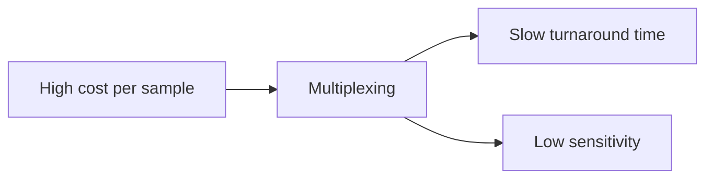

# Bottlenecks in current approaches

In the [previous section](early-detection), we have laid out the need for ubiquitous metagenomic sequencing at the point of care. In this chapter, we focus on the concrete requirements for a clinically viable sequencing device.

## Most infectious disease cases are not linked to causative pathogen

As previously noted, widespread MGS has a clear value for pandemic prevention. However, in the absence of (justified) large-scale investment in a pandemic monitoring networks at the point of care, this technology has to be practical for the clinician in order to become widely used.

In the absence of formal surveys, anecdotal evidence suggests that there is latent demand for a universal diagnostic for respiratory infectious disease. Individuals showing symptoms (fever and or flu-like symptoms) may already be inclined to seek medical assistance. Reports suggest that patients increasingly want to receive a diagnosis rather than “non-specific upper respiratory infection”, the majority diagnosis in ambulatory care visits for respiratory issues.

For instance, Emily Volk[⁶](https://www.zotero.org/google-docs/?qDxcPN) reports:

> *“Frankly, patient experience scores increase when patients leave our care and have a name for the thing that is bothering them even if there isn’t a targeted antibiotic or antimicrobial that has been identified, that would work against the pathogen. It still is comforting to patients and their families to have a name for the illness that they have.”*

Clinicians themselves are becoming more inclined to order broader panels. According to Emmanuel André[⁶](https://www.zotero.org/google-docs/?DXh03H):

> *“The single pathogenic approach will progressively disappear. Why? Because it’s simply not efficient from a clinical perspective, from a lab perspective and care requires a more comprehensive approach. Where I think we’re going is toward broader panels.”*

In samples acquired from patients infected by SARS-CoV-2, the total RNA from nasopharyngeal samples contains viral RNA at up to 5% when ribosomal RNA (rRNA) is depleted.[⁵](https://www.zotero.org/google-docs/?OU3DwX) At this level of abundance, direct sequencing of total RNA would almost certainly reveal the presence of a novel, SARS-CoV-2-like respiratory virus.[^1] Any unknown pathogen sequence identified by these tests may be transmitted to pandemic monitoring centers, allowing novel human pathogen cases to be identified almost as soon as they occur.

It is of note that a number of sequencing-based diagnostic approaches have been attempted during COVID-19. However, they have largely failed to gain traction and cumulatively represented \<1% of the testing used to detect and monitor COVID-19 infections[⁸](https://www.zotero.org/google-docs/?mhRwMO):

There are a number of reasons for this which we summarize in the table below:

|                      | qPCR            | Metagenomic Sequencing |
| -------------------- | --------------- | ---------------------- |
| Cost-of-goods (COGs) | \$1 to \$5      | > \$100                |
| Automation           | Widely deployed | Limited                |
| Time to answer       | \< 1 hour       | Days to Weeks          |

Unless these issues are addressed, metagenomic sequencing-based approaches are unlikely to gain widespread adoption.

### qPCR tests are the golden standard

### High cost per sample necessitates multiplexing

The cheapest runs of Illumina instruments currently cost \~\$300 to \$500[⁹](https://www.zotero.org/google-docs/?NJMTcC). To our knowledge, the cheapest run (Oxford Nanopore’s Flongle) costs closer to $100[¹⁰]. Even at this price point, healthcare providers are unlikely to use these instruments for sequencing single samples.

Batching and **multiplexing** multiple samples for a single sequencing run can significantly reduce the cost per sample, but introduces a delay before sequencing can begin. The delay is dependent on the nature of the testing facility and the number of samples being received per day, but typically, this is on the order of a week. This **delay of days to weeks** is likely unacceptable in an infectious disease diagnostic context where we ideally want to provide results as rapidly as possible.

Another downside of multiplexing onto a single chip is the significant reduction in sensitivity of the test, since the sequence coverage per sample reduces proportional to the number of samples.

Therefore, the high single-run cost for current instruments makes them a poor fit for diagnostic applications. This is the case even if we look at the COGS (Illumina \$50 to \$100s, Oxford Nanopore \$50 to \$450 based on stated margins^([1](https://www.zotero.org/google-docs/?uZfJ69) [12](https://www.zotero.org/google-docs/?tljpmF)). Cheaper options could make running single-sample tests economically viable.

### Complex worfklows limit use

Sequencing-based assays are complex and typically require multiple hours of skilled labor to execute (both in the wet lab and data analysis).

A pushbutton “sample-to-answer” sequencing platform could allow minimally-trained personnel to load a sample and walk away from the device. Such a platform could have a major impact on the ease of implementation of sequencing-based diagnostics. Yet, no sample-to-answer sequencing platform currently exists.

Efforts have been made to automate parts of the sample preparation and library preparation process workflows, but these have largely addressed research applications or users who are comfortable investing effort in developing automation systems to process large numbers of samples in centralized labs. No low-cost fixed protocol suitable for use in a clinical context is available.

### Long time to answer disqualifies sequencing in for infectious disease diagnosis

We previously discussed how the requirement of multiplexing can increase diagnostic turnaround time by days to weeks. Sending samples to a centralized lab followed by the execution of complex workflows by trained personnel also adds significantly to the time to answer. Indeed, current metagenomic-based pathogen tests often have a turnaround time of more than two weeks [¹³](https://www.zotero.org/google-docs/?7jVZxG).

On the sequencing technology front, Illumina’s runs typically fall between 24-48 hours, while their fastest runs are \~4 hours[¹⁴](https://www.zotero.org/google-docs/?RCkl9s),. While this may be sufficient for some use cases, it is hard to see how a truly ubiquitous technology base could be built on this base. However, nanopore and single-molecule approaches can currently provide sequencing data in a \<1-hour timeframe.

[Sample and library preparation](https://sequencing-roadmap.org/sample-prep) are also significant bottlenecks here. This is strongly dependent on the sequencing technology being used but tandard protocols typically take more than 2 hours. In later sections, we discuss approaches which can provide sequencing-ready DNA in \~10 minutes[¹⁵](https://www.zotero.org/google-docs/?gUoxVG).
