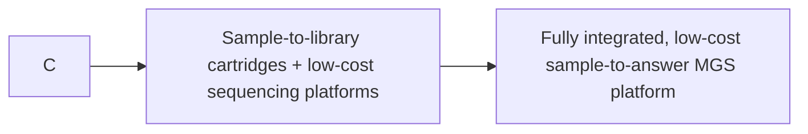

- straightforwardly adapted from qPCR sample-to-answer systems. See chapter on [sample preparation](http://sequencing-roadmap.org/sample-prep).

```mermaid
graph LR
C --> E[Sample-to-library cartridges + low-cost sequencing platforms]
E --> F[Fully integrated, low-cost sample-to-answer MGS platform]
```

## Chapters