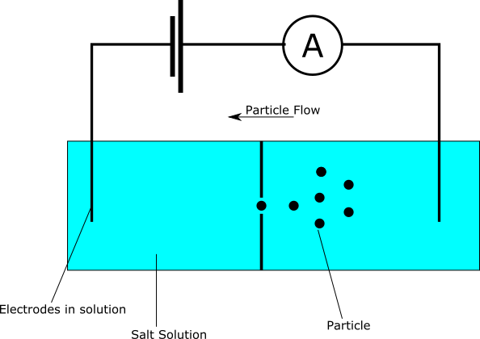

<head>
    <link rel="stylesheet" href="tufte.css"/>
  </head>

 
 
F.J. Cole, “The History of Albrecht Dürer’s Rhinoceros in Zooological Literature,” <em>Science, Medicine, and History: Essays on the Evolution of Scientific Thought and Medical Practice</em> (London, 1953), ed. E. Ashworth Underwood, 337-356. From page 71 of Edward Tufte’s <em>Visual Explanations</em>. But tight integration of graphics with text is central to Tufte’s work even when those graphics are ancillary to the main body of a text. In many of those cases, a margin figure may be most appropriate. To place figures in the margin, just wrap an image (or whatever) in a margin note inside a <code>p</code> tag, as seen to the right of this paragraph.

